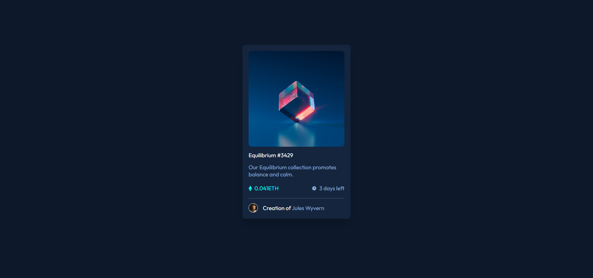

# Frontend Mentor - NFT preview card component solution

This is a solution to the [NFT preview card component challenge on Frontend Mentor](https://www.frontendmentor.io/challenges/nft-preview-card-component-SbdUL_w0U). Frontend Mentor challenges help you improve your coding skills by building realistic projects. 

## Overview
### Screenshot



### Links

- Repository: [GitHub](https://your-solution-url.com)
- Deployment: [Vercel](https://your-live-site-url.com)

## My process

### Built with

- Semantic HTML5 markup
- CSS custom properties
- Flexbox

### What I learned

I learned how to use `<figure>`, but I had to make the change because I couldn't use the icon-view `hover`. I felt more confident with CSS, and sometimes it didn't crash, so I feel like I've made progress with styling. Not to mention, I used variables for the first time and realized that the code became cleaner.

```css
:root {
  --color-blue-500: #8bacdaff;
  --color-cyan-400: #00fff7ff;
  --color-blue-950: #0d192bff; /* main background */
  --color-blue-900: #14253dff; /* card background */
  --color-blue-800: #2f415bff; /* line/divider */
  --color-white: #ffffffff;
  --tamanho-fonte-padrao: 18px;
  --fonte: "Outfit", sans-serif;
}
```

## Author

- Website - [Add your name here](https://www.your-site.com)
- Frontend Mentor - [@yourusername](https://www.frontendmentor.io/profile/yourusername)
- Twitter - [@yourusername](https://www.twitter.com/yourusername)

